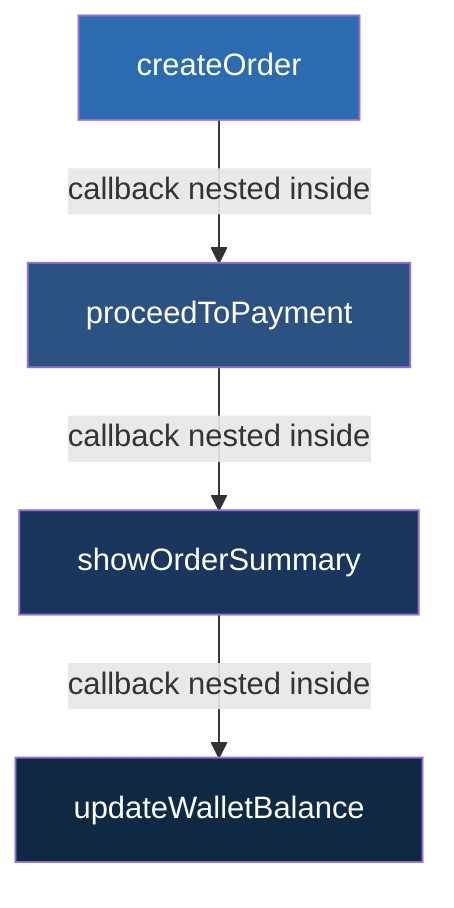

# Namaste JavaScript – Season 2 | Ep. 01 – Callback Hell

**Instructor:** Akshay Saini
**Published:** Aug 18, 2022 | **Duration:** ~15 min
**Link:** https://www.youtube.com/watch?v=yEKtJGha3yM

---

## 1. Why Callbacks Exist — The Theory

**JavaScript is single-threaded** — it has exactly **one Call Stack**, and can execute only **one statement at a time**. Yet real applications constantly need to do things that take unpredictable time: hitting an API, reading a file, waiting for a timer.

If JS "waited" (blocked) on the call stack for every slow operation, the whole page would freeze — no clicks, no scrolling, nothing — until that one operation finished. That's unacceptable for a UI language.

**A callback function** is JS's original solution: *"Don't block. Just tell me what to do **later**, once the slow thing finishes."* You wrap the "later" logic inside a function and hand it to the async operation so it can call it back when ready.

```js
setTimeout(function () {
  console.log("Printed after 5 seconds");
}, 5000);
console.log("Printed immediately");
// Output order: "Printed immediately" -> "Printed after 5 seconds"
```

This is possible because of the **JS runtime environment** (not the engine itself) — Web APIs (`setTimeout`, `fetch`, DOM events) live outside the call stack, run the timer/network work in the background, and push the callback back onto the stack (via the callback/task queue + event loop) once it's ready.

## 2. The E-commerce Example (mental model used throughout the video)

A cart `["shoes", "pants", "kurta"]` needs to go through a strict **sequence of dependent async steps**:

1. `createOrder(cart, callback)` → returns an `orderId`
2. `proceedToPayment(orderId, callback)` → needs step 1's result
3. `showOrderSummary(paymentInfo, callback)` → needs step 2's result
4. `updateWalletBalance(callback)` → needs step 3's result

Because each step **depends on the previous step's output**, the natural (but flawed) way to write this with callbacks is to nest one inside another.

## 3. The Two Problems With Callbacks

### Problem 1: Callback Hell (a.k.a. Pyramid of Doom)

```js
createOrder(cart, function (orderId) {
  proceedToPayment(orderId, function (paymentInfo) {
    showOrderSummary(paymentInfo, function (balance) {
      updateWalletBalance(balance, function () {
        console.log("Order fully placed!");
      });
    });
  });
});
```

- Code grows **horizontally** (rightward) instead of vertically → hard to read, hard to modify, hard to debug.
- This nested, indentation-heavy shape is nicknamed the **"Pyramid of Doom."**
- More steps = deeper nesting = worse.

### Problem 2: Inversion of Control (the more dangerous one)

When you pass a callback into a function you didn't write (e.g., a third-party `createOrder` API), you are **handing over control of your own code** to that function and simply *trusting* it to:

- call your callback **at all**,
- call it **only once**,
- call it **at the right time**,
- call it **with the right data**.

You have no guarantee of any of this. A buggy or malicious API could:

| Broken behavior | Consequence |
|---|---|
| Never call the callback | Your app logic silently never runs |
| Call it twice | Duplicate order created, duplicate payment charged |
| Call it too early/late | Data races, inconsistent UI |
| Swallow an error silently | Bug invisible until production |

This "loss of oversight" over your own program flow is called **Inversion of Control** — arguably a bigger problem than the ugly pyramid shape, because it's a **trust/reliability** issue, not just a readability one.

## 4. Comparison Table

| Aspect | Callback Hell | Inversion of Control |
|---|---|---|
| What breaks | Code readability & structure | Trust & reliability of execution |
| Visible symptom | Deep rightward nesting | Bugs that appear only sometimes |
| Cause | Sequential async steps nested inside each other | Handing your callback to someone else's function |
| Fixed by | Promise chaining (flattens nesting) | Promises (guarantee call-once, no early/late calls) |

## 5. Diagram — Pyramid of Doom vs Flat Structure

```
Callback Hell (grows sideways):              Promise-based (Ep. 2-3 preview):
createOrder(cart, (id) => {                   createOrder(cart)
  proceedToPayment(id, (pay) => {               .then(proceedToPayment)
    showOrderSummary(pay, (sum) => {            .then(showOrderSummary)
      updateWallet(sum, () => {                 .then(updateWallet)
        // done                                 .catch(handleError)
      });
    });
  });
});
```


*Each box is nested one level deeper than the previous — visually this is the "pyramid."*

## 6. Homework From the Video (answered)

> "Explain, in your own words, the two problems with callbacks."

**Answer:**
1. **Callback Hell** — when multiple async operations depend on each other, nesting callbacks inside callbacks causes code to grow horizontally into an unreadable, unmaintainable "pyramid of doom."
2. **Inversion of Control** — passing a callback to another function means you lose control over *if*, *when*, and *how many times* it gets executed; you're blindly trusting external code with a core part of your program's correctness.

## 7. Extra Interview Questions (beyond the video) — Answered

**Q1. Is `setTimeout(fn, 0)` executed immediately?**
No. Even with a 0ms delay, the callback still goes through the Web API → Callback Queue → Event Loop, and only runs once the Call Stack is empty. So it always runs *after* all currently queued synchronous code.

**Q2. Why can't we just use `return` to get data out of an async callback?**
Because the outer function (e.g. `createOrder`) itself returns immediately (synchronously) before the async work (like a network call) completes — there is no value ready to `return` yet. The callback pattern exists specifically to deliver a result *whenever* it becomes available, not right away.

**Q3. Give a real DOM example of a callback (outside APIs/timers).**
```js
document.getElementById("btn").addEventListener("click", function () {
  console.log("Button clicked!"); // callback fires only when the click event happens
});
```

**Q4. Does "callback hell" only happen with `setTimeout`/APIs?**
No — any deeply nested callback structure (event listeners inside event listeners, file reads inside file reads in Node.js, etc.) can produce the same pyramid shape.

**Q5. How do Promises fix Inversion of Control specifically (not just readability)?**
A Promise is a **trusted, immutable** placeholder object. Once settled, its state can never change again, and the JS engine itself (not the third-party author) guarantees your attached `.then()`/`.catch()` handler runs exactly once, with the correct value. You attach a handler to the promise rather than surrendering your callback into someone else's function body.

## 8. Quick Reference Summary

| Concept | One-liner |
|---|---|
| Callback | A function passed to be executed later, after an async task completes |
| Why callbacks are needed | JS is single-threaded and non-blocking; can't "wait" on the call stack |
| Callback Hell | Deeply nested callbacks → unreadable "pyramid of doom" |
| Inversion of Control | Losing control over correct/guaranteed execution of your own callback |
| Fix for both | Promises (Ep. 02 onward) |
