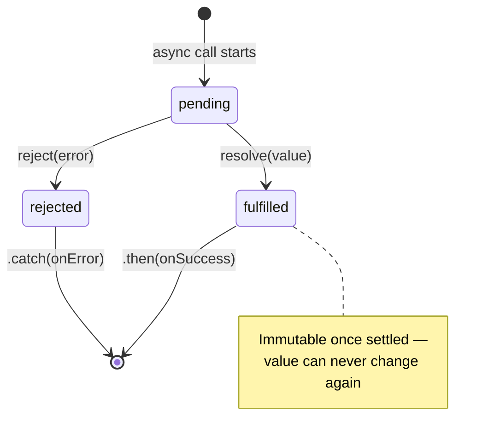

# Namaste JavaScript – Season 2 | Ep. 02 – Promises

**Instructor:** Akshay Saini
**Published:** Oct 8, 2022 | **Duration:** ~39 min
**Link:** https://www.youtube.com/watch?v=ap-6PPAuK1Y

---

## 1. What Is a Promise? — Theory

A **Promise** is a JavaScript object that acts as a **placeholder for a value that doesn't exist yet**, but will (or won't) exist at some point in the future, as the result of an asynchronous operation.

Three equivalent ways to define it (any of these is interview-acceptable):

| Definition style | Wording |
|---|---|
| Casual | "A placeholder for something that will arrive later." |
| Conceptual | "A container for a future value." |
| Technical (MDN-style, most precise) | **"An object representing the eventual completion (or failure) of an asynchronous operation."** |

> 💡 Interview tip from the video: memorize the **technical definition word-for-word** — interviewers often want the precise phrasing, not just the gist, and a crisp definition avoids follow-up "well, explain more" questions.

### Why Promises instead of raw callbacks?

With callbacks, you **pass** a function into an async API and trust it blindly. With Promises, the async API instead **returns an object immediately** (in a `pending` state), and you **attach** your callback to that object using `.then()`. The API never touches your callback function directly — the *JS engine* is the one guaranteeing it's called correctly, exactly once. This directly fixes **Inversion of Control** (see Ep. 01).

## 2. The Three States of a Promise

```
        pending
       /        \
  (async op     (async op
   succeeds)      fails)
     ↓               ↓
 fulfilled        rejected
```

| State | Meaning | Can it change again? |
|---|---|---|
| `pending` | Initial state; async operation hasn't finished | Yes → becomes fulfilled/rejected |
| `fulfilled` | Operation completed successfully; has a value | **No** — immutable once settled |
| `rejected` | Operation failed; has a reason/error | **No** — immutable once settled |

**Immutability is a superpower**: once a promise is fulfilled or rejected, its state and value are locked forever. This is exactly what guarantees your `.then()` callback fires with consistent data — no double-firing, no silent mutation.

## 3. Real Example — `fetch()` Returns a Promise

```js
const user = fetch("https://api.github.com/users/akshaymarch7");
console.log(user);
// PromiseState: "pending"
// PromiseResult: undefined
// (fetch hasn't completed yet — JS didn't wait for it!)
```

Because JS doesn't block, the very next line runs immediately while the network call is still in flight. Only *later*, once GitHub responds, does the same promise object internally flip to `fulfilled` and get its result populated.

```js
fetch("https://api.github.com/users/akshaymarch7")
  .then(function (response) {
    // response is a Response object; body is a ReadableStream
    return response.json(); // .json() ALSO returns a promise!
  })
  .then(function (data) {
    console.log(data); // actual parsed user data
  });
```

## 4. Comparison Table: Callback API vs Promise-Based API

| | Callback style | Promise style |
|---|---|---|
| How you pass in logic | Pass a function *into* the API | *Attach* `.then()` to the returned object |
| Who calls your function | The third-party API code (untrusted) | The JS engine (trusted, standardized) |
| Guarantee of single call | ❌ None | ✅ Guaranteed exactly once |
| Readability with dependent steps | Nested pyramid | Flat chain (`.then().then()`) |
| Error handling | Manual, ad hoc, per-callback | Centralized via `.catch()` |

## 5. Promise Chaining (Preview)

```js
createOrder(cart)
  .then(function (orderId) {
    return proceedToPayment(orderId);
  })
  .then(function (paymentInfo) {
    return showOrderSummary(paymentInfo);
  })
  .then(function (summary) {
    return updateWalletBalance(summary);
  });
```

⚠️ **Common mistake:** forgetting to `return` the inner promise from a `.then()` — without the `return`, the next `.then()` in the chain won't receive the resolved value correctly, and you silently break the chain (details + fix in Ep. 03).

## 6. Diagram — Promise Lifecycle



## 7. Homework From the Video (answered)

> "Define a Promise in your own words and explain why it's important."

**Answer:** A Promise is an object representing the eventual completion (or failure) of an asynchronous operation. It matters because it removes the need to blindly trust callback-accepting APIs — instead of handing over a function and hoping it's called correctly, you get an immutable, standardized object back immediately and attach handlers to it, with the JS engine guaranteeing correct, single execution once the async work settles.

## 8. Extra Interview Questions (beyond the video) — Answered

**Q1. Can a promise change from `fulfilled` back to `pending` or to `rejected`?**
No. Once settled (fulfilled or rejected), a promise's state and value/reason are permanently locked — this immutability is fundamental to why promises are trustworthy.

**Q2. What does `Promise.resolve(value)` do?**
It creates and immediately returns a new promise that is already in the `fulfilled` state with `value` as its result. Useful for normalizing a non-promise value into a promise.

**Q3. If I `console.log()` a pending promise right after calling `fetch()`, then log it again 2 seconds later from the same variable, will it show different states?**
Yes conceptually — the promise *object reference* is the same, but its internal `[[PromiseState]]`/`[[PromiseResult]]` slots update once the async work resolves. DevTools re-inspects the live object, so the second log can show `fulfilled` even though it's the "same" object.

**Q4. What happens if you call `.then()` on a promise that's already fulfilled?**
The `.then()` callback is still scheduled correctly (as a microtask) and fires with the already-resolved value — you don't miss it just because you attached the handler "late."

**Q5. Is a Promise synchronous or asynchronous?**
Creating the Promise wrapper itself is synchronous (the executor function runs immediately), but the *resolution* of async work inside it, and the *execution of `.then()`/`.catch()` handlers*, are asynchronous (scheduled as microtasks).

## 9. Quick Reference Summary

| Concept | One-liner |
|---|---|
| Promise | Object representing the eventual completion/failure of an async operation |
| States | `pending` → `fulfilled` or `rejected` (one-way, permanent) |
| Immutability | Once settled, value/state can never change again |
| Attach vs pass | Promises let you *attach* `.then()` instead of *passing* a callback |
| Fixes | Both Callback Hell (via chaining) and Inversion of Control (via engine-guaranteed calls) |
