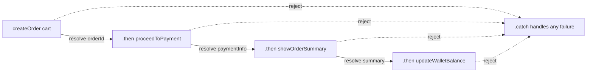

# Namaste JavaScript – Season 2 | Ep. 03 – Creating a Promise, Chaining & Error Handling

**Instructor:** Akshay Saini
**Published:** Oct 13, 2022 | **Duration:** ~39 min
**Link:** https://www.youtube.com/watch?v=U74BJcr8NeQ

---

## 1. Consumer vs Producer — Theory

Until now (Ep. 02) we were only **consuming** promises created by someone else (`fetch`). This episode teaches how to **produce** (create) your own promises — i.e., write the actual async API, not just use one.

| Role | What they do | Example |
|---|---|---|
| **Producer** | Creates and returns a promise; decides when/how it resolves or rejects | Writing `createOrder()` |
| **Consumer** | Attaches `.then()`/`.catch()` to use the eventual result | Calling `createOrder(cart).then(...)` |

## 2. The `Promise` Constructor

```js
const promise = new Promise(function (resolve, reject) {
  // "executor" function — runs SYNCHRONOUSLY and immediately
  // resolve and reject are built-in functions provided by the JS engine
  // you call ONE of them (never both) to settle the promise
});
```

- `resolve` and `reject` are **not user-defined** — JS hands them to you as parameters of the executor function.
- Call `resolve(value)` on success.
- Call `reject(new Error("message"))` on failure — always reject with an `Error` object (or subclass), not a plain string, so consumers get a proper stack trace.
- A promise can be **fulfilled or rejected — never both, and never more than once.**

## 3. Full Producer Example

```js
const cart = ["shoes", "pants", "kurta"];

function validateCart(cart) {
  return true; // simplified for the demo; a real impl would check items
}

function createOrder(cart) {
  const orderPromise = new Promise(function (resolve, reject) {
    if (!validateCart(cart)) {
      const err = new Error("Cart is not valid");
      reject(err);
      return; // stop further execution after rejecting
    }
    // Simulate async order creation (e.g., a DB/API call)
    const orderId = "12345";
    resolve(orderId);
  });
  return orderPromise;
}
```

## 4. Consuming It — with Proper Error Handling

```js
createOrder(cart)
  .then(function (orderId) {
    console.log("Order created:", orderId);
  })
  .catch(function (err) {
    console.log("Something went wrong:", err.message);
  });
```

⚠️ **Without `.catch()`**, a rejected promise becomes an **unhandled promise rejection** — shown as a scary red error in the console, and in a real app it can crash a Node process or silently fail the UI. Always attach a `.catch()` (or use try/catch with async/await, Ep. 04).

## 5. Promise Chaining, Correctly

Chaining lets you run dependent async steps **without nesting**, by returning a new promise from inside each `.then()`:

```js
createOrder(cart)
  .then(function (orderId) {
    return proceedToPayment(orderId); // MUST return this promise
  })
  .then(function (paymentInfo) {
    return showOrderSummary(paymentInfo);
  })
  .then(function (balance) {
    return updateWalletBalance(balance);
  })
  .catch(function (err) {
    console.log(err.message); // catches ANY error from ANY step above
  });
```

### ⚠️ The #1 Chaining Mistake

If you forget `return` inside a `.then()`, the next `.then()` in the chain does **not** receive the inner promise's resolved value — it receives `undefined` (or the wrong value), and the chain silently breaks. This is sometimes called **"promise hell"** when developers try to work around it with nested `.then()`s instead of returning properly — recreating the exact pyramid problem promises were meant to solve.

```js
// ❌ WRONG — missing return
createOrder(cart).then(function (orderId) {
  proceedToPayment(orderId); // not returned! next .then() gets undefined
}).then(function (paymentInfo) {
  console.log(paymentInfo); // undefined ❌
});

// ✅ CORRECT
createOrder(cart).then(function (orderId) {
  return proceedToPayment(orderId); // returned!
}).then(function (paymentInfo) {
  console.log(paymentInfo); // correct value ✅
});
```

## 6. Advanced Error Handling — Placement of `.catch()` Matters

A `.catch()` only concerns itself with errors that occurred **before** it in the chain. Anything after a `.catch()` still executes normally (the chain "recovers").

```js
createOrder(cart)
  .then(proceedToPayment)
  .catch(function (err) {
    console.log("Payment-related error:", err.message);
  })
  .then(showOrderSummary)   // ✅ still runs even if a payment error was caught above
  .catch(function (err) {
    console.log("General error:", err.message); // catches anything else downstream
  });
```

**Pattern:** place a specific `.catch()` right after the step(s) it should guard, then a generic `.catch()` at the very end for anything unforeseen.

## 7. Comparison Table

| | Callback Hell | Correct Promise Chain | Broken "Promise Hell" |
|---|---|---|---|
| Structure | Nested pyramid | Flat, linear | Nested again (misuse) |
| Data passed forward | Manual, error-prone | Automatic via `return` | Lost / `undefined` |
| Error handling | Scattered, per-callback | Centralized `.catch()` | Confusing, duplicated |
| Readability | Poor | Good | Poor |

## 8. Diagram — Promise Chain Data Flow



## 9. Homework From the Video (answered)

> "Write a promise chain for: createOrder → proceedToPayment → showOrderSummary → updateWalletBalance."

```js
function createOrder(cart) {
  return new Promise((resolve, reject) => {
    if (!validateCart(cart)) return reject(new Error("Cart is not valid"));
    resolve("orderId_123");
  });
}
function proceedToPayment(orderId) {
  return new Promise((resolve) => resolve(`payment_success_for_${orderId}`));
}
function showOrderSummary(paymentInfo) {
  return new Promise((resolve) => resolve(`summary_for_${paymentInfo}`));
}
function updateWalletBalance(summary) {
  return new Promise((resolve) => resolve(`wallet_updated_after_${summary}`));
}

createOrder(["shoes", "pants", "kurta"])
  .then(proceedToPayment)
  .then(showOrderSummary)
  .then(updateWalletBalance)
  .then((finalMsg) => console.log(finalMsg))
  .catch((err) => console.log(err.message));
```

## 10. Extra Interview Questions (beyond the video) — Answered

**Q1. What's the difference between `resolve()`/`reject()` and `return`?**
`resolve`/`reject` settle the *promise itself* (change its internal state). `return` inside a `.then()` callback determines what value/promise gets passed to the *next* `.then()` in the chain. They operate at different levels.

**Q2. Can you `resolve()` a promise with another promise?**
Yes — if you call `resolve(anotherPromise)`, the outer promise "adopts" the state of `anotherPromise` and waits for it to settle before settling itself. This is exactly why `return somePromise` inside a `.then()` works for chaining.

**Q3. What happens if both `resolve()` and `reject()` are called in the executor?**
Only the **first** call wins — a promise can only settle once. Any subsequent `resolve`/`reject` calls are silently ignored.

**Q4. Why should you always `reject()` with an `Error` object instead of a string?**
`Error` objects carry a `message`, a `stack` trace, and a `name`, which are invaluable for debugging. Rejecting with a plain string loses all of that context.

**Q5. Does an error thrown synchronously inside the executor get caught by `.catch()`?**
Yes — if you `throw` synchronously inside the `new Promise((resolve, reject) => { throw new Error(...) })` executor, JS automatically treats that as a rejection, so `.catch()` on the returned promise will catch it.

## 11. Quick Reference Summary

| Concept | One-liner |
|---|---|
| `new Promise((resolve, reject) => {...})` | Constructor for producing your own promise |
| `resolve` / `reject` | Built-in functions to settle the promise (success/failure) |
| Golden rule of chaining | Always `return` the inner promise/value from a `.then()` |
| `.catch()` scope | Only catches errors *before* it in the chain; code after it still runs |
| Best practice | One `.catch()` per risky segment + one generic `.catch()` at the end |
