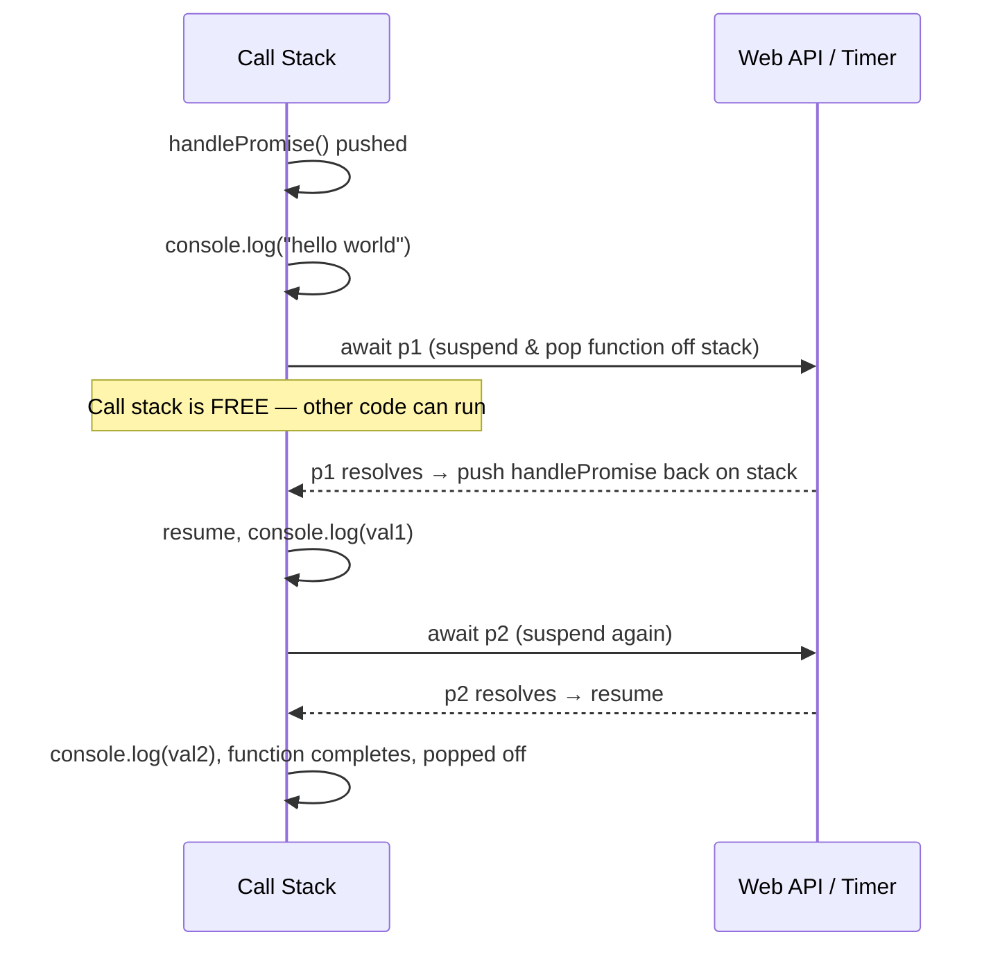

# Namaste JavaScript – Season 2 | Ep. 04 – async await

**Instructor:** Akshay Saini
**Published:** Sep 2023 | **Duration:** ~1h 11m
**Link:** https://www.youtube.com/watch?v=6nv3qy3oNkc

---

## 1. What Is `async`? — Theory

`async` is a keyword placed before a function declaration/expression. It does exactly **one guaranteed thing**: **an `async` function always returns a Promise.**

```js
async function getData() {
  return "Namaste";
}
const p = getData();
console.log(p); // Promise {<fulfilled>: 'Namaste'}
```

| Return statement inside `async fn` | Actual returned value |
|---|---|
| `return "some string"` / number / object | Auto-wrapped: `Promise.resolve("some string")` |
| `return somePromise` | Returned **as-is** — NOT double-wrapped |

```js
async function getData() {
  return new Promise((resolve) => resolve("Promise result value"));
}
getData().then((val) => console.log(val)); // "Promise result value"
```

## 2. What Is `await`? — Theory

`await` can be used **only inside an `async` function** (using it elsewhere throws a `SyntaxError`). It is placed before a Promise (or promise-returning expression) and tells the JS engine:

> "Pause **this function's execution** here until the promise settles, but do NOT block the main thread — let everything else in the call stack keep running."

```js
async function handlePromise() {
  console.log("hello world"); // runs immediately, synchronously
  const val = await new Promise((resolve) =>
    setTimeout(() => resolve("promise resolved value"), 10000)
  );
  console.log(val); // prints only after 10 seconds
}
handlePromise();
```

## 3. The Core Misconception — Corrected

Most learners think JS "freezes"/blocks at an `await`. **It does not.** What actually happens:

1. The `async` function executes **line by line, synchronously, like normal**, until it hits `await`.
2. At `await`, the function is **suspended and removed from the Call Stack** (so the stack stays empty/free for other work — clicks, other functions, timers, etc.).
3. The engine keeps a reference to *where* to resume.
4. Once the awaited promise settles, the function is **pushed back onto the Call Stack** and resumes from exactly that line.

This is why the call stack does **not** freeze the browser while `await` is "waiting" — other code, events, and even other async functions continue running normally in the meantime.

## 4. Multiple `await`s — Do They Run Sequentially or in Parallel?

```js
async function handlePromise() {
  console.log("hello world");
  const val1 = await p1; // p1 resolves in 5s
  console.log(val1);
  const val2 = await p2; // p2 resolves in 10s
  console.log(val2);
}
```

| Scenario | Behavior |
|---|---|
| `p1` resolves in 5s, `p2` in 10s | "hello world" immediately → `val1` at 5s → `val2` at 10s (total wait ≈ 10s, since p2 was already "ticking" during p1's wait) |
| `p1` resolves in 10s, `p2` in 5s | "hello world" immediately → engine must still wait the full 10s for `p1` first (even though p2 finished at 5s) → then `val1` at 10s → `val2` immediately after (already resolved) |

**Key insight:** the *timers run concurrently in the background* (Web APIs), but your `await`s inside one function are still processed **in the order written** — each line waits for its own promise, but doesn't reset or restart the other pending timers.

## 5. Real-World Example — `fetch` with async/await

```js
async function handlePromise() {
  const data = await fetch("https://api.github.com/users/akshaymarch7");
  const json = await data.json(); // .json() ALSO returns a promise — must await it too
  console.log(json);
}
handlePromise();
```

Compare with `.then()` chaining (Ep. 02/03):

```js
// Same logic, promise-chain style
fetch("https://api.github.com/users/akshaymarch7")
  .then((data) => data.json())
  .then((json) => console.log(json));
```

## 6. Error Handling: `try/catch` vs `.catch()`

```js
// Preferred with async/await
async function handlePromise() {
  try {
    const data = await fetch("https://invalid-url.com");
    const json = await data.json();
    console.log(json);
  } catch (err) {
    console.log(err); // control jumps straight here on ANY failure above
  }
}

// Equivalent using .catch() on the async function's returned promise
handlePromise().catch((err) => console.log(err));
```

## 7. Comparison Table: Promise `.then()/.catch()` vs `async/await`

| | `.then()/.catch()` | `async/await` |
|---|---|---|
| Syntax style | Chained callbacks | Looks synchronous / linear |
| Underlying mechanism | Same — async/await is **syntactic sugar** over promises | Same |
| Error handling | `.catch()` | `try/catch` |
| Readability with many steps | Can get long chains | Very readable, easy to trace |
| Debuggability | Harder to set breakpoints mid-chain | Easier — step line by line |
| Multiple parallel calls | Natural with `.then()` chains | Needs `Promise.all` + `await` together (see Ep. 05) |

> **Interview one-liner:** "`async/await` is syntactic sugar built on top of Promises — same guarantees, cleaner syntax."

## 8. Diagram — Call Stack Behavior With `await`



## 9. Extra Interview Questions (beyond the video) — Answered

**Q1. Does `await` block the main thread?**
No. It suspends only the **current async function's execution**; the call stack is freed up and the rest of the program (UI, other functions, other events) continues to run normally.

**Q2. What's the output order here?**
```js
console.log("1");
async function foo() {
  console.log("2");
  await null;
  console.log("3");
}
foo();
console.log("4");
```
Output: `1, 2, 4, 3`. Everything before the first `await` inside `foo()` runs synchronously (so "2" logs before "4"), but once `await` is hit, `foo()` yields control back — so "4" (the rest of the outer synchronous code) logs before "3" (which resumes as a microtask).

**Q3. Can you use `await` at the top level of a module (outside any function)?**
Yes, in ES modules, "top-level await" is supported (modern JS/Node). Outside of a module context or inside a regular script/function, `await` is only legal inside an `async` function.

**Q4. If an `async` function has no `await` at all, does it still return a promise?**
Yes — the `async` keyword alone guarantees a promise return, regardless of whether `await` is used inside.

**Q5. What's the difference in error propagation between `await` inside `try/catch` vs a bare unhandled `await`?**
Without `try/catch`, a rejected awaited promise causes the `async` function itself to return a rejected promise (which then needs a `.catch()` on the call site, or it becomes an unhandled rejection). With `try/catch`, the rejection is caught locally and the function can recover/continue gracefully.

## 10. Quick Reference Summary

| Concept | One-liner |
|---|---|
| `async` function | Always returns a Promise (auto-wraps non-promise return values) |
| `await` | Pauses the async function (not the whole program) until a promise settles |
| Blocking? | No — call stack is freed while an `await` is pending |
| Relationship to Promises | `async/await` = syntactic sugar over `.then()/.catch()` |
| Error handling | `try { await ... } catch (err) { ... }` |
| Multiple awaits | Execute in written order, but underlying timers run concurrently |
