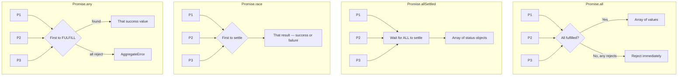

# Namaste JavaScript – Season 2 | Ep. 05 – Promise APIs + Interview Questions

**Instructor:** Akshay Saini
**Published:** Oct 19, 2023 | **Duration:** ~59 min
**Link:** https://www.youtube.com/watch?v=DlTVt1rZjIo

---

## 1. Why Promise APIs? — Theory

Everything so far handled **one promise at a time**, or a **sequential chain** of dependent promises. But a very common real-world need is: *"I have several independent async calls — run them all at once (in parallel) and tell me about all of them together."*

Example: 10 user IDs need 10 separate `fetch()` calls for user info. You don't want to `await` them one by one (slow, sequential) — you want them to fire **simultaneously** and be told when they're all done.

JavaScript provides **four static `Promise` methods** for exactly this, each with different semantics for success/failure combinations.

## 2. `Promise.all([p1, p2, p3])`

- Runs all promises in parallel.
- **Resolves** with an array of all results, **only once every promise has fulfilled**.
- **"Fail-fast":** if **any single promise rejects**, `Promise.all` immediately rejects with that error — it does not wait for the others (though they continue running in the background; they just can't be cancelled).

```js
const p1 = new Promise((resolve) => setTimeout(() => resolve("P1 success"), 3000));
const p2 = new Promise((resolve) => setTimeout(() => resolve("P2 success"), 1000));
const p3 = new Promise((resolve) => setTimeout(() => resolve("P3 success"), 2000));

Promise.all([p1, p2, p3])
  .then((results) => console.log(results)) // ["P1 success","P2 success","P3 success"] after 3s
  .catch((err) => console.log(err));

// If p2 instead REJECTS after 1s:
// Promise.all rejects immediately at 1s with p2's error — doesn't wait for p1/p3.
```

**Use when:** you need *all* results to proceed (e.g., loading all data required to render a page — partial data is useless).

## 3. `Promise.allSettled([p1, p2, p3])`

- Also runs in parallel, but **always waits for every promise to settle** (fulfilled OR rejected) — never fails fast.
- Resolves with an array of **status objects**, one per input promise:

```js
Promise.allSettled([p1, p2, p3]).then((results) => console.log(results));
/*
[
  { status: "fulfilled", value: "P1 success" },
  { status: "rejected",  reason: "P2 failed" },
  { status: "fulfilled", value: "P3 success" }
]
*/
```

**Use when:** partial success is acceptable (e.g., a dashboard with 5 independent widgets — show the 4 that loaded even if 1 API failed).

## 4. `Promise.race([p1, p2, p3])`

- Settles (fulfilled **or** rejected) as soon as the **first promise settles** — whichever finishes first, win or lose.
- If the fastest-settling promise **fails**, `race` rejects with that error (doesn't matter that others might have succeeded).

```js
// p2 resolves fastest (1s) → race resolves with "P2 success" at 1s
Promise.race([p1, p2, p3]).then((val) => console.log(val));

// If the FASTEST one to settle happens to be a rejection, race rejects with that error.
```

**Use when:** you only care about the quickest response (e.g., hitting multiple redundant mirror servers and using whichever responds first).

## 5. `Promise.any([p1, p2, p3])`

- Similar to `race`, but **only cares about success** — waits for the **first fulfilled** promise, ignoring rejections along the way.
- Resolves with that first successful value.
- **Rejects only if ALL promises reject**, and does so with a special **`AggregateError`** containing an array of all individual errors.

```js
Promise.any([p1, p2, p3])
  .then((val) => console.log(val))   // first SUCCESS, ignoring any earlier failures
  .catch((err) => {
    console.log(err);        // AggregateError: All promises were rejected
    console.log(err.errors); // array of individual error objects
  });
```

**Use when:** you want the first successful result and don't care which one, but a single failure among many shouldn't kill the whole operation (e.g., trying multiple CDNs — succeed if any one works).

## 6. Comparison Table (the interview-critical one)

| API | Waits for | Resolves with | Rejects when | Typical use case |
|---|---|---|---|---|
| `Promise.all` | ALL to fulfill | Array of all values | ANY one rejects (fail-fast) | Need every result to proceed |
| `Promise.allSettled` | ALL to settle | Array of `{status, value/reason}` | Never rejects | Partial success is OK |
| `Promise.race` | First to settle | That one value | First-settled one is a rejection | Only care about speed |
| `Promise.any` | First to fulfill | That one value | ALL reject → `AggregateError` | Want first success, tolerate some failures |

## 7. Key Interview Vocabulary (the video stresses this explicitly)

| Term | Meaning |
|---|---|
| **Resolve** | Verb — to make a promise transition out of `pending` on success |
| **Fulfilled** | State — the promise succeeded and has a value |
| **Reject** | Verb — to make a promise transition out of `pending` on failure |
| **Settled** | State — the promise is no longer `pending` (either fulfilled **or** rejected) |
| **Success/Failure** | Casual synonyms for fulfilled/rejected |

> "Settled" ≠ "Success." Settled just means "done, one way or the other." Confusing this in an interview is a common red flag.

## 8. Diagram — All Four APIs Side by Side



## 9. Extra Interview Questions (beyond the video) — Answered

**Q1. Can you cancel a promise once `Promise.all` has already rejected due to one failure?**
No — native JS promises are **not cancellable**. The other promises in the array continue running to completion in the background even though `Promise.all` has already rejected; their results are simply ignored.

**Q2. What does `Promise.all([])` (empty array) resolve with?**
It resolves immediately with an empty array `[]`, since there's nothing to wait for.

**Q3. How would you implement your own simplified `Promise.all` using `.then()`/counters?**
```js
function myPromiseAll(promises) {
  return new Promise((resolve, reject) => {
    const results = new Array(promises.length);
    let completed = 0;
    promises.forEach((p, i) => {
      Promise.resolve(p)
        .then((val) => {
          results[i] = val;
          completed++;
          if (completed === promises.length) resolve(results);
        })
        .catch(reject); // fail fast, same as native Promise.all
    });
  });
}
```

**Q4. Difference between `Promise.race` and `Promise.any` in one sentence?**
`race` cares about *whoever settles first* (win or lose); `any` cares about *whoever succeeds first* and ignores failures unless everything fails.

**Q5. Why does `Promise.any`'s rejection use `AggregateError` instead of a normal `Error`?**
Because multiple promises could have failed for different reasons, and a single `Error` can only carry one message — `AggregateError` bundles all individual rejection reasons into its `.errors` array so nothing is lost.

## 10. Quick Reference Summary

| API | Mnemonic |
|---|---|
| `Promise.all` | "All or nothing, fail fast" |
| `Promise.allSettled` | "Tell me about everyone, good or bad" |
| `Promise.race` | "First to the finish line, win or lose" |
| `Promise.any` | "First winner, ignore the losers" |
| Vocabulary to nail in interviews | resolve / fulfilled / reject / settled |
