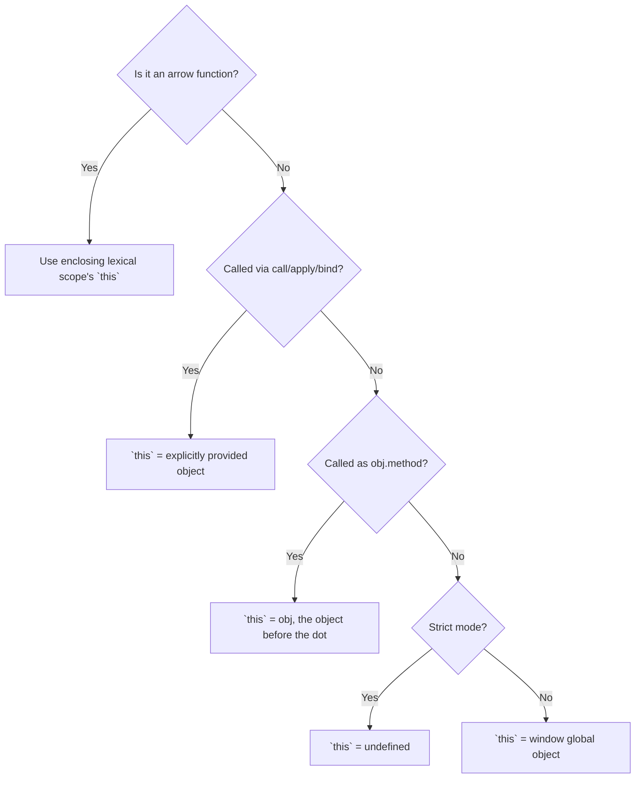

# Namaste JavaScript – Season 2 | Ep. 06 – `this` Keyword in JavaScript

**Instructor:** Akshay Saini
**Published:** Dec 31, 2023 | **Duration:** ~53 min
**Link:** https://www.youtube.com/watch?v=9T4z98JcHR0

---

## 1. Why `this` Confuses People — Theory

Unlike most variables, `this` is **not determined by where it's written** (lexically) in most cases — it's determined by **how a function is called** (its "call-site"), which JS calls **runtime binding** (dynamic scoping for `this`, as opposed to lexical scoping for regular variables). Its value changes across: global scope, function calls, method calls, arrow functions, `call/apply/bind`, and DOM event handlers — six different rulesets to memorize.

## 2. `this` in the Global Space

```js
console.log(this); // in a browser: the `window` object
```

- In browsers → `this` at the top level refers to the **global `window` object**.
- In Node.js (module scope) → refers to an empty `module.exports` object (not `global`), because Node wraps files in a module wrapper function.

## 3. `this` Inside a Regular Function

```js
function x() {
  console.log(this);
}
x(); // called with NO object reference before it
```

| Mode | Value of `this` inside `x()` |
|---|---|
| Non-strict mode | `window` (global object) — due to **`this` substitution** |
| `"use strict"` | `undefined` |

### `this` Substitution Rule
If the value of `this` would otherwise be `null` or `undefined`, JS **substitutes** it with the global object — but **only in non-strict mode**. This is a legacy behavior kept for backward compatibility.

## 4. `this` Depends on **How** You Call the Function (not where it's defined)

```js
function x() { console.log(this); }

x();          // this = window (non-strict) / undefined (strict)
window.x();   // this = window   (called AS a property of window)
```

Same function, different call-site → different `this`. This is **runtime/dynamic binding**.

## 5. `this` Inside an Object Method

```js
const obj = {
  a: 10,
  x: function () {
    console.log(this);   // this = obj (the object the method was called on)
    console.log(this.a); // 10
  },
};
obj.x(); // this refers to obj, because obj called it: `obj.x()`
```

**Function vs Method:** a plain standalone function is called a "function"; when it's a property of an object and invoked via that object, it's called a **"method"** — and `this` inside a method refers to the object left of the dot at the call-site.

## 6. `call`, `apply`, `bind` — Sharing Methods Across Objects

```js
const student1 = { name: "Alex", printName: function () { console.log(this.name); } };
const student2 = { name: "Bob" }; // has NO printName of its own

student1.printName();              // "Alex"
student2.printName();              // ❌ TypeError — printName doesn't exist on student2

student1.printName.call(student2); // ✅ "Bob" — explicitly sets `this` to student2
```

| Method | Invokes immediately? | Arguments passed as | Returns |
|---|---|---|---|
| `.call(thisArg, a, b, ...)` | Yes | Comma-separated list | Function's return value |
| `.apply(thisArg, [a, b, ...])` | Yes | Array | Function's return value |
| `.bind(thisArg, a, b, ...)` | **No** | Comma-separated list | A **new function**, to call later |

```js
const boundFn = student1.printName.bind(student2);
boundFn(); // "Bob" — invoked later, `this` is pre-set
```

## 7. `this` Inside Arrow Functions — The Big Exception

**Arrow functions do NOT have their own `this` binding at all.** They don't follow runtime binding — instead they use **lexical (enclosing) scope**: they pick up `this` from whatever `this` was in the surrounding code **where they were physically written** (defined), not where/how they're called.

```js
const obj = {
  a: 10,
  x: () => {
    console.log(this); // ❌ NOT obj — inherits `this` from the enclosing scope (global/window)
  },
};
obj.x(); // this = window, NOT obj — because arrow fns ignore call-site rules

const obj2 = {
  a: 10,
  x: function () {
    const y = () => {
      console.log(this.a); // ✅ 10 — inherits `this` from the enclosing `x` function, which IS obj2
    };
    y();
  },
};
obj2.x();
```

**Rule of thumb:** never use an arrow function directly as an object method if you need `this` to refer to that object. Arrow functions shine *inside* a regular method, where they inherit the correct `this` from their enclosing function.

## 8. `this` Inside DOM Event Handlers

```js
document.getElementById("btn").addEventListener("click", function () {
  console.log(this); // `this` = the actual button DOM element that was clicked
  console.log(this.tagName); // "BUTTON"
});
```

Regular `function` event handlers get `this` bound to the element the listener is attached to. (If you use an arrow function here instead, `this` would leak from the enclosing lexical scope instead of referring to the button — a very common bug.)

## 9. Comparison Table — `this` Across Contexts

| Context | Value of `this` |
|---|---|
| Global space (browser) | `window` |
| Regular function, non-strict, called plainly | `window` (via substitution) |
| Regular function, strict mode, called plainly | `undefined` |
| Function called as `obj.method()` | `obj` |
| `fn.call(x)` / `.apply(x)` / `.bind(x)()` | Explicitly `x` |
| Arrow function (anywhere) | Inherited from enclosing lexical scope (NOT the call-site) |
| DOM event handler (regular `function`) | The DOM element that triggered the event |
| DOM event handler (arrow function) | Inherited from surrounding scope — usually **not** the element (common bug) |

## 10. Diagram — Decision Flow for "What Is `this` Here?"



## 11. Homework From the Video (answered)

> "Explain in your own words the value of `this` inside a DOM element/event handler."

**Answer:** When a regular (non-arrow) function is used as an event handler, JavaScript sets `this` inside that handler to be the specific DOM element the listener was attached to — because the handler is effectively "called" as a method on that element internally by the browser. This lets you write generic handlers like `this.classList.toggle(...)` or `this.tagName` that work on whichever element triggered the event, without hardcoding a reference to it.

## 12. Extra Interview Questions (beyond the video) — Answered

**Q1. What is the value of `this` inside a `class` constructor/method?**
Same rule as object methods: `this` refers to the specific instance the method was called on (e.g., `new MyClass().method()` → `this` = that instance). Classes are strict mode by default, so plain function-style `this` substitution to `window` never applies inside them.

**Q2. What does `this` refer to inside a `setTimeout` callback?**
If it's a regular `function`, `this` is `window` (non-strict) or `undefined` (strict) — `setTimeout` calls it plainly, not as a method. If it's an arrow function, it inherits `this` from wherever the `setTimeout(...)` call itself was written.

**Q3. Can you change what `this` an arrow function refers to using `.call()`/`.bind()`?**
No — arrow functions permanently ignore `call`/`apply`/`bind`'s attempt to override `this`; they always use their original lexical `this`, no exceptions.

**Q4. What does `this` refer to in a nested regular function inside an object method (NOT an arrow function)?**
It reverts to the "plain call" rules (`window`/`undefined`), NOT the outer object — this is a classic gotcha, because people expect it to still be the object.
```js
const obj = { a: 10, x: function () {
  function y() { console.log(this); } // called plainly inside x
  y(); // this = window/undefined, NOT obj!
  y();
}};
```

**Q5. In Node.js modules, what does top-level `this` refer to?**
An empty object (`module.exports`), not `global` and not `undefined` — a Node-specific quirk that differs from browsers.

## 13. Quick Reference Summary

| Rule | Value |
|---|---|
| Global scope | `window` |
| Plain function call, non-strict | `window` (substitution) |
| Plain function call, strict | `undefined` |
| `obj.method()` | `obj` |
| `call`/`apply`/`bind` | Whatever object is explicitly passed |
| Arrow function | Lexical — inherited from where it's *defined*, ignores call-site entirely |
| DOM handler (regular fn) | The element that fired the event |
| Golden rule | Arrow functions = lexical `this`; everything else = runtime/call-site `this` |
